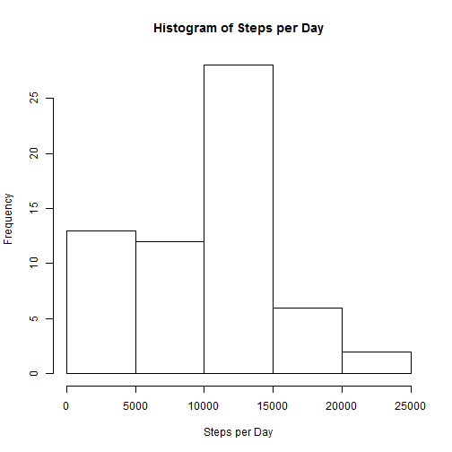
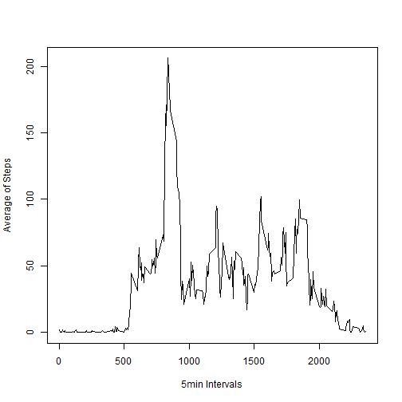
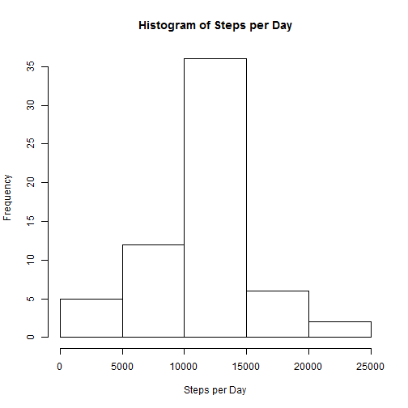
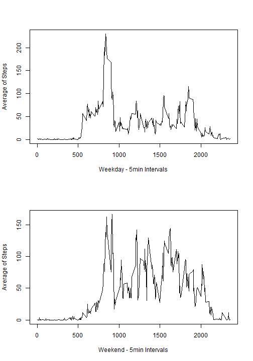

This is an R Markdown document about reproducible research of Project 1.

#### Loading and preprocessing the data

In the first step We will load the data.

```r
data<-read.csv("activity.csv")
```

For this moment We do not provide any prepocessing.

#### What is mean total number of steps taken per day?

1. Calculate the total number of steps taken per day

We will ignore the missing values so we will set `na.rm = TRUE`. The result is saved in variable `steps_per_day`. 

```r
steps_per_day<-tapply(data$steps, data$date, sum, na.rm=TRUE)
```

We can see the result.

```r
steps_per_day
```

```
## 2012-10-01 2012-10-02 2012-10-03 2012-10-04 2012-10-05 2012-10-06 
##          0        126      11352      12116      13294      15420 
## 2012-10-07 2012-10-08 2012-10-09 2012-10-10 2012-10-11 2012-10-12 
##      11015          0      12811       9900      10304      17382 
## 2012-10-13 2012-10-14 2012-10-15 2012-10-16 2012-10-17 2012-10-18 
##      12426      15098      10139      15084      13452      10056 
## 2012-10-19 2012-10-20 2012-10-21 2012-10-22 2012-10-23 2012-10-24 
##      11829      10395       8821      13460       8918       8355 
## 2012-10-25 2012-10-26 2012-10-27 2012-10-28 2012-10-29 2012-10-30 
##       2492       6778      10119      11458       5018       9819 
## 2012-10-31 2012-11-01 2012-11-02 2012-11-03 2012-11-04 2012-11-05 
##      15414          0      10600      10571          0      10439 
## 2012-11-06 2012-11-07 2012-11-08 2012-11-09 2012-11-10 2012-11-11 
##       8334      12883       3219          0          0      12608 
## 2012-11-12 2012-11-13 2012-11-14 2012-11-15 2012-11-16 2012-11-17 
##      10765       7336          0         41       5441      14339 
## 2012-11-18 2012-11-19 2012-11-20 2012-11-21 2012-11-22 2012-11-23 
##      15110       8841       4472      12787      20427      21194 
## 2012-11-24 2012-11-25 2012-11-26 2012-11-27 2012-11-28 2012-11-29 
##      14478      11834      11162      13646      10183       7047 
## 2012-11-30 
##          0
```

2. Make a histogram of the total number of steps taken each day.

```r
hist(steps_per_day, xlab = "Steps per Day", main="Histogram of Steps per Day")
```

 

3. Calculate and report the mean and median of the total number of steps taken per day

So if we ignore the missing values we will compute mean and median as:

```r
mean(steps_per_day, na.rm = TRUE)
```

```
## [1] 9354.23
```

```r
median(steps_per_day, na.rm = TRUE)
```

```
## [1] 10395
```

#### What is the average daily activity pattern?

1. Make a time series plot (i.e. `type = "l"`) of the 5-minute interval (x-axis) and the average number of steps taken, averaged across all days (y-axis)

So we want the average (`mean`) for every interval throught all days. 

```r
av_steps<-tapply(data$steps, data$interval, mean, na.rm = TRUE)
plot(x=names(av_steps),av_steps, type="l", xlab = "5min Intervals", ylab = "Average of Steps")
```

 

2. Which 5-minute interval, on average across all the days in the dataset, contains the maximum number of steps?

```r
names(which.max(av_steps))
```

```
## [1] "835"
```

#### Imputing missing values

1. Calculate and report the total number of missing values in the dataset

```r
sum(is.na(data$steps))
```

```
## [1] 2304
```

2. Devise a strategy for filling in all of the missing values in the dataset

3. Create a new dataset that is equal to the original dataset but with the missing data filled in

So we will replace the missing value by mean for that 5min intervals and we will create new dataset

```r
new_data<-data
new_data[is.na(new_data$steps),1]<-as.numeric(av_steps[as.character(new_data[is.na(new_data$steps),3])])
```

It can seem little bit confused but it is simple. We create new data set as a replic from data and there we fill NA values.

First we take 3rd column from new dataset but only rows with NAs. Then we take it as character because of format of `av_steps`. From `av_steps` we take the value of average and save it as numeric to the first column of new dataset where the valus are NAs.

4. Make a histogram of the total number of steps taken each day and Calculate and report the mean and median total number of steps taken per day. Do these values differ from the estimates from the first part of the assignment? What is the impact of imputing missing data on the estimates of the total daily number of steps?

```r
steps_per_day<-tapply(new_data$steps, new_data$date, sum, na.rm=TRUE)
hist(steps_per_day, xlab = "Steps per Day", main="Histogram of Steps per Day")
```

 

```r
mean(steps_per_day, na.rm = TRUE)
```

```
## [1] 10766.19
```

```r
median(steps_per_day, na.rm = TRUE)
```

```
## [1] 10766.19
```
We can see that mean and median are higher than mean and median from case with NA values. The mean is same as median in this case. 

#### Are there differences in activity patterns between weekdays and weekends?

1. Create a new factor variable in the dataset with two levels – “weekday” and “weekend” indicating whether a given date is a weekday or weekend day

```r
library(lubridate)
new_data$week<-wday(ymd(new_data$date))
new_data$week<-replace(new_data$week, new_data$week %in% 2:6, "weekday")
new_data$week<-replace(new_data$week, new_data$week %in% c(1,7), "weekend")
```

We created new colum week in new_data. In first row of code we put number into column week which represented day in the week (1 - Sunday, 7 - Saturday). We replaced this number by weekday or weekend according the number.

2. Make a panel plot containing a time series plot (i.e. type = "l") of the 5-minute interval (x-axis) and the average number of steps taken, averaged across all weekday days or weekend days (y-axis)

In first step we split `new_data` into two dataframe by type of week (weekend, weekday) and store into variable `split_data`.

```r
split_data<-split(new_data, new_data$week)
```


```r
weekday<-split_data[["weekday"]]
weekend<-split_data[["weekend"]]
av_steps_day<-tapply(weekday$steps, weekday$interval, mean, na.rm = TRUE)
av_steps_end<-tapply(weekend$steps, weekend$interval, mean, na.rm = TRUE)
par(mfrow=c(2,1)) 
plot(x=names(av_steps_day),av_steps_day, type="l", xlab = "Weekday - 5min Intervals", ylab = "Average of Steps")
plot(x=names(av_steps_end),av_steps_end, type="l", xlab = "Weekend - 5min Intervals", ylab = "Average of Steps")
```

 


